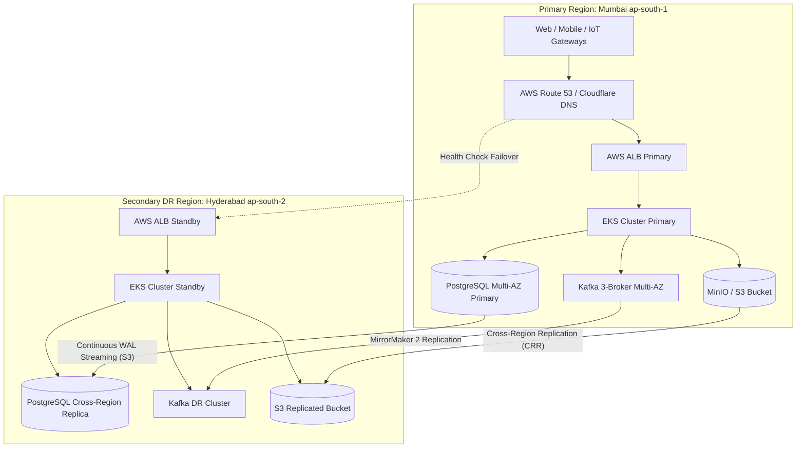

# StockAI Disaster Recovery (DR) & Business Continuity Runbook

## 1. Objectives & SLAs
* **Target RPO (Recovery Point Objective)**: $\le 5\text{ seconds}$ (Continuous WAL streaming & Multi-AZ synchronous replication).
* **Target RTO (Recovery Time Objective)**: $< 30\text{ minutes}$ (Automated Kubernetes failover & DNS cutover).

---

## 2. Multi-Region Architecture Topology


---

## 3. Step-by-Step Regional Failover Procedure

### Phase 1: Failover Declaration & Traffic Cutover (< 5 mins)
1. **Health Check Detection**: Route 53 / Cloudflare Health Probes detect unresponsiveness from Primary Region endpoint.
2. **Promote DNS CNAME**:
   ```bash
   aws route53 change-resource-record-sets --hosted-zone-id Z123456789 --change-batch '{
     "Changes": [{
       "Action": "UPSERT",
       "ResourceRecordSet": {
         "Name": "stockai.svpgroup.com",
         "Type": "CNAME",
         "TTL": 60,
         "ResourceRecords": [{"Value": "k8s-dr-alb-hyderabad.amazonaws.com"}]
       }
     }]
   }'
   ```

### Phase 2: Database Promotion (< 10 mins)
1. **Promote PostgreSQL Standby to Primary**:
   ```bash
   # On AWS RDS:
   aws rds promote-read-replica --db-instance-identifier stockai-db-dr-replica
   
   # Or Self-Managed PostgreSQL with Patroni / touch trigger:
   pg_ctl promote -D /var/lib/postgresql/data
   ```
2. **Verify LSN and Database Health**:
   ```sql
   SELECT pg_is_in_recovery(), pg_last_wal_replay_lsn();
   ```

### Phase 3: Kubernetes Cluster Activation (< 15 mins)
1. **Restore Latest Cluster State via Velero**:
   ```bash
   velero restore create --from-schedule stockai-hourly-cluster-backup --namespace stockai-prod
   ```
2. **Scale Deployment Replicas to Full Capacity**:
   ```bash
   kubectl scale deployment stockai-deployment -n stockai-prod --replicas=6
   kubectl rollout status deployment/stockai-deployment -n stockai-prod --timeout=180s
   ```

### Phase 4: Verification & Integrity Check (< 5 mins)
1. **Execute Smoke Test Suite**:
   ```bash
   curl -fk https://stockai.svpgroup.com/actuator/health
   ```
2. **Verify IoT Telemetry and Inventory Balances**:
   Verify that sequence numbers resume seamlessly and active user sessions remain valid.

---

## 4. Continuous Verification & Testing Schedule
* **Weekly Automated Restore Drill**: GitHub Actions runs [`.github/workflows/dr-drill.yml`](file:///.github/workflows/dr-drill.yml) every Sunday at 02:00 UTC.
* **Semi-Annual Live Failover Simulation**: Chaos engineering team triggers synthetic region degradation to validate end-to-end RTO $< 30$ mins.
