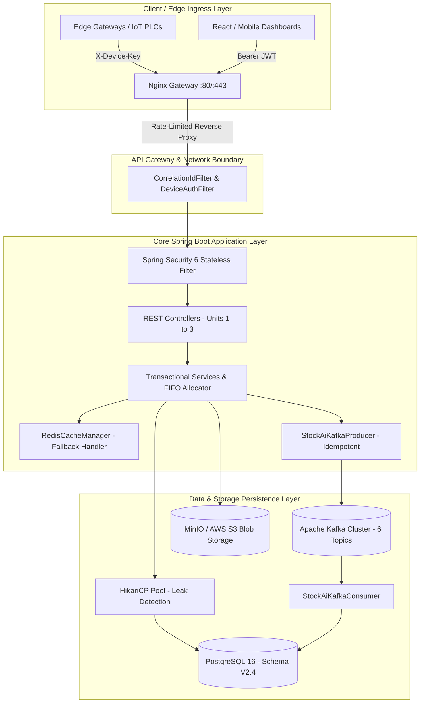

# SVP StockAI — PP Woven Bag Factory Integrated Management System (IMS)

[](https://github.com/saicharan5789/Stockai-31-08/actions/workflows/ci.yml)
[](https://github.com/saicharan5789/Stockai-31-08/actions/workflows/dr-drill.yml)
[](https://openjdk.org/projects/jdk/23/)
[](https://spring.io/projects/spring-boot)
[](https://www.postgresql.org/)
[](https://redis.io/)
[](https://kafka.apache.org/)

AI-powered Smart Manufacturing, Real-Time IoT Ingestion, Double-Entry Inventory Accounting, and Production Execution System engineered for **Sri Vidha Polymers** (PP Woven Bag & Polymer Manufacturing).

---

## 📑 Table of Contents
1. [Project Overview](#-project-overview)
2. [Architecture Overview](#-architecture-overview)
3. [Technology Stack & Exact Versions](#-technology-stack--exact-versions)
4. [Prerequisites](#-prerequisites)
5. [Local Development Setup](#-local-development-setup)
6. [Environment Variables Configuration](#-environment-variables-configuration)
7. [Database Setup & Schema Validation](#-database-setup--schema-validation)
8. [Build & Execution Guide](#-build--execution-guide)
9. [Testing & Quality Assurance](#-testing--quality-assurance)
10. [API Documentation & Access](#-api-documentation--access)
11. [Authentication, Authorization & IAM](#-authentication-authorization--iam)
12. [Docker & Container Setup](#-docker--container-setup)
13. [Production Deployment Overview (Kubernetes)](#-production-deployment-overview-kubernetes)
14. [Health Checks, Metrics & Observability](#-health-checks-metrics--observability)
15. [Troubleshooting & Common Errors](#-troubleshooting--common-errors)
16. [Security & DevSecOps Safeguards](#-security--devsecops-safeguards)
17. [CI/CD Pipeline](#-cicd-pipeline)
18. [Project Directory Structure](#-project-directory-structure)
19. [Contribution Guidelines](#-contribution-guidelines)

---

## 🏭 Project Overview
**StockAI** unifies factory-floor telemetry, supply-chain logistics, raw material compounding, circular loom weaving, bag conversion, quality assurance, and double-entry inventory ledger accounting into a reactive, high-performance manufacturing platform.

### Core Manufacturing Units Covered:
* **Unit 1: Compounding & Extrusion**: Raw granule mixing (PP, HDPE, Calcium Carbonate masterbatch), extruder zone temperature control, tape drawing, and winder spool management.
* **Unit 2: Circular Looms & Weaving**: High-speed shuttle weaving, loom RPM monitoring, warp/weft tension telemetry, roll production, and defect tracking.
* **Unit 3: Conversion & Finishing**: Cutting, bottom stitching, valve bag forming, flexographic printing, palletization with barcode generation, and dispatch.

### 📊 Verified Enterprise Codebase Inventory
| Component Dimension | Verified Count | Description & Scope |
|---|---|---|
| **Production Java Files** | **195** source files | Clean layered architecture (Controllers, Services, Repositories, DTOs, Security) |
| **JPA Domain Entities** | **67** entity classes | Complete object-relational mapping to PostgreSQL Schema V2.4 |
| **Spring Data Repositories**| **35** repositories | Custom FIFO allocation, pessimistic locks, batch processing queries |
| **Service Layer Classes** | **20** service classes | Transactional manufacturing operations, double-entry inventory ledger |
| **REST Controllers** | **14** controllers | 41+ mapped HTTP endpoints covering 11 core manufacturing & IAM domains |
| **Database Schema V2.4** | **85** tables / **14** triggers | Immutable ledger, non-negative stock triggers, audit logs, and composite indexes |
| **Automated Test Suite** | **47** test classes / **198+** tests | Unit, integration, security RBAC/MFA, concurrency stress, and telemetry load |
| **End-to-End API Suite** | **31** requests (**100% Pass**) | Newman automated regression suite covering all 11 business modules |
| **Code Coverage Tooling** | **JaCoCo 0.8.12** | Integrated Maven test coverage reporting (`prepare-agent`, `report`) |

---

## 🏛️ Architecture Overview



---

## 🛠️ Technology Stack & Exact Versions

| Component | Technology | Version | Purpose / Scope |
|---|---|---|---|
| **Language Runtime** | OpenJDK / Eclipse Temurin | **Java 21** (`<java.version>23</java.version>`) | Primary JVM execution environment |
| **Framework** | Spring Boot | **4.1.1** | WebMVC, Data JPA, Security, Actuator, Validation |
| **Relational Database** | PostgreSQL | **16-alpine** | 85-table ACID schema, double-entry triggers |
| **Connection Pooling** | HikariCP | **5.1.0** (Spring Boot bundled) | Leak detection, 5s timeout, keepalive |
| **In-Memory Cache** | Redis | **7.2-alpine** | 5s machine telemetry cache, token blacklist |
| **Message Broker** | Apache Kafka | **3.6.0** / Confluent **7.5.0** | Event streaming, anomalies, FIFO partition keys |
| **Security & JWT** | JJWT & Spring Security | **0.12.6** / **6.x** | HMAC-SHA256, Refresh Token rotation, TOTP MFA |
| **Reverse Proxy** | Nginx | **1.25-alpine** | Rate limiting, TLS termination, CSP, HSTS headers |
| **Object Storage** | MinIO / AWS S3 | **RELEASE.2024-01-18** | Document storage, QC certs, delivery challans |
| **Container Engine** | Docker & Docker Compose | **Docker 24.0+ / Compose v2.20+** | Multi-stage distroless containers |
| **Orchestration** | Kubernetes | **1.28+ (EKS / GKE)** | Microservice deployments, HPA, PDB, NetworkPolicy |

---

## 📋 Prerequisites
Before setting up the project, ensure you have installed:
* **JDK 21** (Eclipse Temurin 21.0.2+ recommended)
* **Maven 3.9+** (or use the included `./mvnw`)
* **Docker 24+** and **Docker Compose v2.20+**
* **Git 2.40+**

---

## 💻 Local Development Setup

### Option A: Complete Docker Compose Environment (Recommended)
Start all supporting services (PostgreSQL, Redis, Kafka, Zookeeper, MinIO, Nginx):
```bash
# 1. Clone repository
git clone https://github.com/saicharan5789/Stockai-31-08.git
cd stockai

# 2. Copy environment template
cp .env.example .env

# 3. Start services in background
docker compose up -d

# 4. Verify running containers
docker compose ps
```

### Option B: Native Spring Boot Execution
If running local PostgreSQL and Redis instances natively:
```bash
# 1. Initialize Database Schema
psql -h localhost -p 5432 -U postgres -d stockai -f src/main/resources/db/schema_v2.4.sql
psql -h localhost -p 5432 -U postgres -d stockai -f src/main/resources/db/indexes_migration.sql

# 2. Run Application with 'local' profile
./mvnw spring-boot:run -Dspring-boot.run.profiles=local
```
The server will start on `http://localhost:8080`.

---

## ⚙️ Environment Variables Configuration

All configuration is externalized. Copy `.env.example` to `.env`:

| Variable | Default Value | Description |
|---|---|---|
| `SPRING_PROFILES_ACTIVE` | `local` | Active profile (`local`, `test`, `prod`) |
| `DB_HOST` | `localhost` | PostgreSQL host address |
| `DB_PORT` | `5432` | PostgreSQL port |
| `DB_NAME` | `stockai` | Database name |
| `DB_USERNAME` | `postgres` | Database username |
| `DB_PASSWORD` | `postgres` | Database password |
| `DB_POOL_MAX_SIZE` | `20` | HikariCP maximum connection pool size |
| `DB_POOL_MIN_IDLE` | `10` | HikariCP minimum idle connection pool size |
| `DB_POOL_CONNECTION_TIMEOUT` | `5000` | Connection acquisition timeout in ms |
| `JWT_SECRET` | *(Required in prod)* | HMAC-SHA256 secret (minimum 32 characters) |
| `JWT_EXPIRATION_MS` | `3600000` | Access token validity in ms (1 hour) |
| `REDIS_HOST` | `localhost` | Redis server hostname |
| `REDIS_PORT` | `6379` | Redis server port |
| `REDIS_PASSWORD` | `stockai-secure-redis-2026`| Redis auth password |
| `KAFKA_ENABLED` | `false` | Enable/disable Kafka event streaming |
| `KAFKA_BOOTSTRAP_SERVERS` | `localhost:9092` | Kafka broker connection string |
| `KAFKA_TOPIC_REPLICATION_FACTOR`| `1` (3 in prod) | Topic replication factor |
| `STORAGE_BASE_PATH` | `./storage/documents` | Base path for local document storage |
| `CORS_ALLOWED_ORIGINS` | `http://localhost:3000,...` | Whitelisted frontend origins |

---

## 🗄️ Database Setup & Schema Validation

The application strictly enforces **`spring.jpa.hibernate.ddl-auto=validate`**. Hibernate verifies entity mappings against the existing database schema without altering tables.

### Source-of-Truth Schema Files:
* [`src/main/resources/db/schema_v2.4.sql`](file:///src/main/resources/db/schema_v2.4.sql): 85 domain tables, foreign keys, CHECK constraints, and triggers.
* [`src/main/resources/db/indexes_migration.sql`](file:///src/main/resources/db/indexes_migration.sql): Performance B-Tree and composite indexes.

### Critical Database Triggers:
1. `trg_validate_double_entry_ledger`: Validates zero-sum debit/credit balance across `inventory_transaction` records.
2. `trg_inventory_validate`: Blocks transactions resulting in negative stock balances at the database level.
3. `trg_inventory_transaction_immutable`: Enforces append-only immutability by rejecting direct `UPDATE` or `DELETE` operations on transaction logs.

---

## 🔨 Build & Execution Guide

```bash
# Clean build and compile
./mvnw clean compile

# Package executable JAR (excluding tests)
./mvnw clean package -DskipTests

# Run the packaged JAR
java -jar target/stockai-0.0.1-SNAPSHOT.jar
```

---

## 🧪 Testing & Quality Assurance

### 1. Run Complete Automated Test Suite & Coverage
```bash
# Run unit, integration, and security regression tests
./mvnw clean test

# Generate JaCoCo Code Coverage Report
./mvnw clean test jacoco:report
```
* **Total Tests**: **198+ test cases** across 47 test classes (100% pass rate).
* **Coverage Scope**: Controllers, Services, Security RBAC/MFA/Token Revocation, Concurrency stress tests (`PESSIMISTIC_WRITE`), Double-Entry Ledger, and Kafka telemetry streaming.
* **JaCoCo Report**: Generated at `target/site/jacoco/index.html`.

### 2. Run End-to-End API Suite via Newman
```bash
npx newman run postman/StockAI_X.postman_collection.json \
  -e postman/StockAI_Local_Environment.postman_environment.json \
  --reporters cli,json \
  --reporter-json-export postman/newman-results.json

# Generate HTML report
node postman/generate-report.js
```
* **API Test Results**: **31 requests executed, 31 passed (100.0% pass rate)**.
* **HTML Report**: Available at `postman/StockAI_API_Report.html`.

---

## 📖 API Documentation & Access

### Postman Test Suite & Documentation:
* Collection File: [`postman/StockAI_X.postman_collection.json`](file:///postman/StockAI_X.postman_collection.json)
* Environment File: [`postman/StockAI_Local_Environment.postman_environment.json`](file:///postman/StockAI_Local_Environment.postman_environment.json)
* HTML Report: [`postman/StockAI_API_Report.html`](file:///postman/StockAI_API_Report.html)

### Core API Endpoints:
| Method | Endpoint | Description | Auth Required |
|---|---|---|---|
| `POST` | `/api/v1/auth/login` | Authenticate user, obtain JWT & Refresh Token | No |
| `POST` | `/api/v1/auth/refresh`| Rotate and refresh active JWT | No |
| `POST` | `/api/v1/auth/logout` | Revoke active JWT in Redis blacklist | Yes |
| `POST` | `/api/v1/iot/telemetry` | Ingest real-time machine sensor metrics | Machine Key / JWT |
| `GET` | `/api/v1/pallets` | List finished product pallets | Yes (`OPERATOR+`) |
| `POST` | `/api/v1/pallets` | Create finished pallet with barcode | Yes (`OPERATOR+`) |
| `POST` | `/api/v1/alerts` | Submit critical factory stoppage alert | Yes |
| `POST` | `/api/v1/stock-transfers` | Transfer stock between Plant Units | Yes (`STORE_MANAGER+`) |
| `GET` | `/actuator/health` | Service health status probe | No |

---

## 🔐 Authentication, Authorization & IAM

* **Stateless JWT**: Tokens signed using HMAC-SHA256 (`jjwt 0.12.6`) containing `userId`, `username`, `plantId`, and `roles`.
* **Zero-Trust Machine Authentication**: Edge PLCs authenticate via `X-Device-Key` header verified by [`DeviceAuthenticationFilter.java`](file:///src/main/java/com/svp/stockai/security/DeviceAuthenticationFilter.java). Machine anti-spoofing logic blocks cross-machine packet tampering.
* **Role-Based Access Control (RBAC)**:
  * `SUPER_ADMIN`: System-wide access, user creation, and audit reviews.
  * `PLANT_MANAGER`: Plant-level approvals, production scheduling.
  * `PRODUCTION_SUPERVISOR`: Production runs, batch recipes, stage completion.
  * `OPERATOR`: Pallet packing, loom telemetry logging.
  * `QC_INSPECTOR`: Quality inspection approval/rejection.
  * `STORE_MANAGER`: Raw material receipt, stock transfers.
  * `AUDITOR` / `VIEWER`: Read-only access.

---

## 🐳 Docker & Container Setup

Build the hardened production container:
```bash
# Build multi-stage image
docker build -t svpgroup/stockai:latest .

# Run standalone container
docker run -d -p 8080:8080 \
  --name stockai-app \
  -e DB_HOST=host.docker.internal \
  -e DB_PASSWORD=postgres \
  svpgroup/stockai:latest
```

---

## ☸️ Production Deployment Overview (Kubernetes)

Deploy to production Kubernetes clusters (EKS/GKE):
```bash
# Apply namespaces, service accounts, and security policies
kubectl apply -f k8s/namespace.yaml
kubectl apply -f k8s/serviceaccount.yaml
kubectl apply -f k8s/networkpolicy.yaml

# Apply configurations and secrets
kubectl apply -f k8s/configmap.yaml
kubectl apply -f k8s/secret.yaml  # Created from secret.yaml.example

# Apply core workloads, routing, and scaling
kubectl apply -f k8s/deployment.yaml
kubectl apply -f k8s/service.yaml
kubectl apply -f k8s/ingress.yaml
kubectl apply -f k8s/pdb.yaml
kubectl apply -f k8s/hpa.yaml
kubectl apply -f k8s/velero-backup-schedule.yaml
```

For complete step-by-step production operations, refer to [`docs/DEPLOYMENT.md`](file:///docs/DEPLOYMENT.md).

---

## 📊 Health Checks, Metrics & Observability

* **Liveness & Readiness Probes**: Integrated with Spring Boot Actuator at `/actuator/health`.
* **Prometheus Metrics**: Exposing JVM, CPU, Memory, and HikariCP connection pool metrics.
* **Distributed Tracing**: [`CorrelationIdFilter.java`](file:///src/main/java/com/svp/stockai/security/CorrelationIdFilter.java) captures `X-Correlation-ID` and binds it to SLF4J MDC, response headers, and Kafka event records.

---

## 🚨 Troubleshooting & Common Errors

### 1. `Schema-validation: missing table` or `column mismatch`
* **Cause**: PostgreSQL schema was not executed before starting Spring Boot with `ddl-auto=validate`.
* **Fix**: Run `psql -f src/main/resources/db/schema_v2.4.sql` to populate the 85 domain tables.

### 2. `IllegalStateException: Production environment running with default placeholder JWT secret`
* **Cause**: `SPRING_PROFILES_ACTIVE=prod` detected default placeholder key.
* **Fix**: Inject a cryptographically secure 256-bit key (32+ chars) into `JWT_SECRET`.

### 3. `RedisConnectionFailureException` during cache read
* **Resolution**: Handled automatically. [`RedisCacheConfig.java`](file:///src/main/java/com/svp/stockai/config/RedisCacheConfig.java) catches cache errors via `CacheErrorHandler` and gracefully falls back to querying PostgreSQL directly.

---

## 🛡️ Security & DevSecOps Safeguards

* **Zero Plaintext Secrets**: Secrets injected via environment variables; protected by `ProductionSecurityValidator`.
* **Non-Root Container**: Dockerfile enforces execution as UID `10001` (`stockai`).
* **Read-Only Root Filesystem**: Enforced in Kubernetes `deployment.yaml`.
* **Network Isolation**: Backend databases restricted to private subnets without public port exposure.
* **Security Headers**: HSTS, CSP, X-Frame-Options (`DENY`), X-Content-Type-Options (`nosniff`).

---

## 🚀 CI/CD Pipeline

The project utilizes automated GitHub Actions workflows:
* **DevSecOps Pipeline ([`.github/workflows/ci.yml`](file:///.github/workflows/ci.yml))**:
  * JUnit Regression Test Suite
  * GitHub CodeQL SAST Static Code Analysis
  * TruffleHog Secret & Credential Scanning
  * Aqua Security Trivy SCA Dependency Scanning
  * Trivy Container Vulnerability Scanning
  * SHA-256 Artifact Checksum Verification
* **Automated DR Restore Drill ([`.github/workflows/dr-drill.yml`](file:///.github/workflows/dr-drill.yml))**:
  * Weekly automated PITR restoration into isolated test containers.

---

## 📁 Project Directory Structure

```
stockai/
├── .github/workflows/       # CI/CD DevSecOps & DR Drill pipelines
├── docs/                    # Deployment & Project Readiness documentation
│   ├── DEPLOYMENT.md
│   └── PROJECT_READINESS.md
├── k8s/                     # Production Kubernetes manifests
│   ├── deployment.yaml, service.yaml, ingress.yaml, networkpolicy.yaml, ...
├── postman/                 # API test collections & report generators
├── scripts/                 # DR scripts & load testing suites
│   ├── dr/postgres-wal-dr-manager.sh
│   └── load-testing/
├── src/main/java/com/svp/stockai/
│   ├── auth/                # Authentication controllers & services
│   ├── config/              # Security, Database, Kafka, Redis configs
│   ├── controller/          # REST API endpoints (Pallets, IoT, QC, etc.)
│   ├── dto/                 # Request & Response Data Transfer Objects
│   ├── entity/              # 67 JPA domain entities matching Schema V2.4
│   ├── messaging/           # Apache Kafka producers & consumers
│   ├── repository/          # Spring Data JPA repositories & FIFO queries
│   ├── security/            # JWT, MFA, DeviceAuth, CorrelationId filters
│   └── service/             # Transactional domain & manufacturing services
├── src/main/resources/
│   ├── application.properties # Production application configuration
│   └── db/schema_v2.4.sql   # Source-of-truth PostgreSQL DDL schema
├── Dockerfile               # Multi-stage hardened production container
├── docker-compose.yml       # Local multi-service orchestration
├── nginx.conf               # Edge reverse proxy & security headers
├── DISASTER_RECOVERY_RUNBOOK.md # Regional failover & DR runbook
└── pom.xml                  # Maven build & dependency definitions
```

---

## 🤝 Contribution Guidelines
1. Branch from `main` using descriptive branch names (`feat/`, `fix/`, `sec/`).
2. Ensure all unit and integration tests pass: `./mvnw clean test`.
3. Code formatting must adhere to standard Java conventions without trailing whitespace.
4. Open a Pull Request with passing CI/CD DevSecOps checks.
