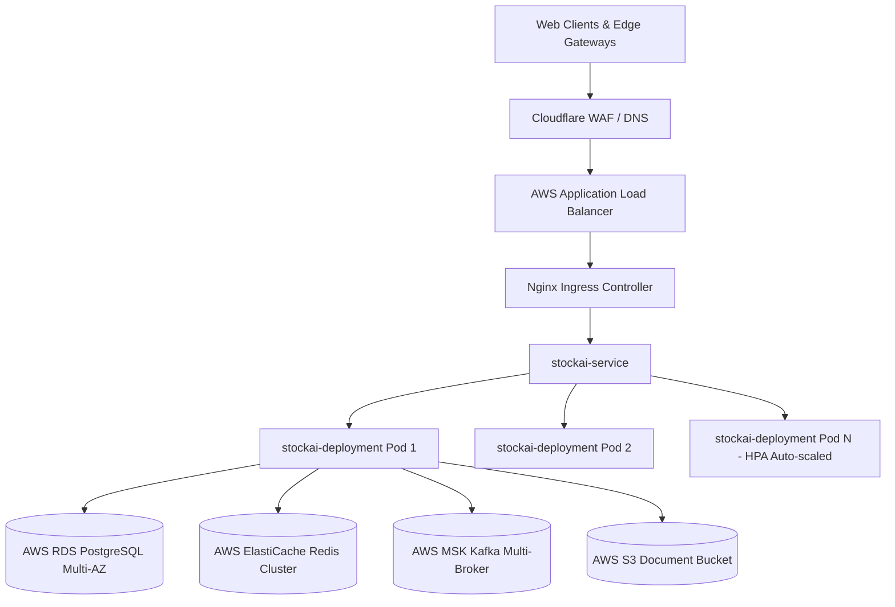

# SVP StockAI — Enterprise Deployment & Operations Guide

This guide provides step-by-step instructions for deploying the **SVP StockAI** platform across Local Development, Staging/Testing, and Production Kubernetes environments.

---

## 1. Prerequisites & Version Requirements

| Dependency | Minimum Version | Recommended / Production Version | Purpose |
|---|---|---|---|
| **Java / OpenJDK** | Java 23 | Eclipse Temurin 23.0.2+ | Core Application Runtime |
| **Maven** | 3.9+ | Bundled Maven Wrapper (`./mvnw`) | Dependency & Build Management |
| **Docker** | 24.0+ | Docker Engine 25.0+ / Containerd | Containerization |
| **Docker Compose** | v2.20+ | v2.24+ | Local Multi-Service Orchestration |
| **PostgreSQL** | 16.0+ | 16-alpine / 18.6 Enterprise | Primary ACID Relational Database |
| **Redis** | 7.0+ | 7.2-alpine (Authenticated) | In-Memory Telemetry & Blacklist Cache |
| **Apache Kafka** | 3.5+ | Confluent 7.5.0 / Kafka 3.6+ | Event Streaming & Telemetry Pipeline |
| **MinIO / AWS S3** | S3 API v4 | RELEASE.2024-01-18+ / AWS S3 | Blob / Document Storage |
| **Kubernetes** | 1.28+ | 1.29+ (EKS / GKE) | Production Container Orchestration |

---

## 2. Local Development Setup

### Step 1: Clone Repository & Verify JDK
```bash
git clone https://github.com/saicharan5789/Stockai-31-08.git
cd stockai
java -version  # Verify JDK 23
```

### Step 2: Configure Environment Variables
Copy `.env.example` to create your local `.env` file:
```bash
cp .env.example .env
```
Ensure `SPRING_PROFILES_ACTIVE=local` and configure local database credentials if running native services.

### Step 3: Start Supporting Infrastructure via Docker Compose
To start PostgreSQL, Redis, Kafka, Zookeeper, MinIO, and Nginx Gateway:
```bash
docker compose up -d postgres redis kafka minio
```
Verify container health:
```bash
docker compose ps
```

### Step 4: Initialize Database Schema (First-Time Setup)
If not using the automated Docker initialization script:
```bash
# Connect to PostgreSQL and execute DDL
psql -h localhost -p 5432 -U postgres -d stockai -f src/main/resources/db/schema_v2.4.sql
psql -h localhost -p 5432 -U postgres -d stockai -f src/main/resources/db/indexes_migration.sql
```

### Step 5: Build & Run the Spring Boot Application
```bash
# Build executable jar
./mvnw clean package -DskipTests

# Run application locally
./mvnw spring-boot:run -Dspring-boot.run.profiles=local
```

### Step 6: Verify Application Health
```bash
curl -i http://localhost:8080/actuator/health
```
Expected Response: `{"status":"UP"}`

---

## 3. Testing Setup & Test Execution

### 1. Run Unit, Integration, and Security Tests
```bash
./mvnw clean test
```
The test suite validates:
* **198 Unit & Integration Tests**: Spring Data JPA queries, FIFO batch allocations, pessimistic locking, JWT generation, MFA/TOTP validation, token revocation blacklist, and Kafka producer/consumer streaming.
* **Concurrency & Stress Tests**: Thread contention, transaction rollbacks, and pessimistic locks on `InventoryTransaction`.
* **Zero-Trust Machine Authentication**: `DeviceAuthenticationFilter` device key enforcement and anti-spoofing logic.

### 2. Run Newman / Postman API Test Suite
```bash
# Start full Docker Compose environment
docker compose up -d

# Execute Newman test collection
npx newman run postman/StockAI_X.postman_collection.json \
  -e postman/StockAI_Local_Environment.json \
  --reporters cli,json \
  --reporter-json-export postman/newman-results.json
```

---

## 4. Production Deployment Setup (Kubernetes / EKS / GKE)



### Step 1: Infrastructure Requirements
* **EKS / GKE Cluster**: Minimum 3 worker nodes across 3 Availability Zones (e.g. `m6i.xlarge`).
* **Database**: AWS RDS PostgreSQL 16+ Multi-AZ with automated continuous backup and storage autoscaling.
* **Cache**: AWS ElastiCache for Redis 7.x with in-transit encryption (TLS) and auth token.
* **Streaming**: AWS MSK (Managed Streaming for Apache Kafka) 3.6+ with 3 brokers and TLS auth.
* **Storage**: AWS S3 Bucket with SSE-KMS encryption and Cross-Region Replication (CRR).

### Step 2: Inject Production Secrets
Create `k8s/secret.yaml` (never committed to git) or inject secrets using AWS Secrets Manager / External Secrets Operator:
```bash
kubectl apply -f k8s/namespace.yaml
kubectl apply -f k8s/serviceaccount.yaml

kubectl create secret generic stockai-secret -n stockai-prod \
  --from-literal=DB_PASSWORD='<PROD_POSTGRES_PASSWORD>' \
  --from-literal=JWT_SECRET='<PROD_256BIT_SECRET_MIN_32_CHARS>' \
  --from-literal=REDIS_PASSWORD='<PROD_REDIS_AUTH_PASSWORD>'
```

### Step 3: Build & Push Docker Container Image
```bash
# Build production image using multi-stage Dockerfile
docker build -t svpgroup/stockai:2026.1.0 .

# Tag and push to Amazon ECR / Private Registry
docker tag svpgroup/stockai:2026.1.0 123456789012.dkr.ecr.ap-south-1.amazonaws.com/stockai:2026.1.0
docker push 123456789012.dkr.ecr.ap-south-1.amazonaws.com/stockai:2026.1.0
```

### Step 4: Apply Kubernetes Manifests
```bash
kubectl apply -f k8s/configmap.yaml
kubectl apply -f k8s/networkpolicy.yaml
kubectl apply -f k8s/deployment.yaml
kubectl apply -f k8s/service.yaml
kubectl apply -f k8s/ingress.yaml
kubectl apply -f k8s/pdb.yaml
kubectl apply -f k8s/hpa.yaml
kubectl apply -f k8s/velero-backup-schedule.yaml
```

### Step 5: Verify Rollout Status & Probes
```bash
kubectl rollout status deployment/stockai-deployment -n stockai-prod --timeout=180s
kubectl get pods -n stockai-prod
```
Verify that:
* Pods run as unprivileged UID `10001` (`stockai`).
* Root filesystem is mounted read-only (`readOnlyRootFilesystem: true`).
* Startup probes, readiness probes, and liveness probes report healthy.

---

## 5. Observability, Logging & Monitoring

* **Health & Metrics Endpoints**:
  * Health Probe: `GET /actuator/health`
  * Application Info: `GET /actuator/info`
  * Prometheus Metrics: `GET /actuator/prometheus`
* **Distributed Tracing**:
  * Every HTTP request is tracked via `X-Correlation-ID` header.
  * Injected into SLF4J MDC and Kafka event record headers.
* **Centralized Logging**:
  * Logs output structured text/JSON to stdout for collection by Promtail/Loki, FluentBit, or AWS CloudWatch Container Insights.

---

## 6. Rollback & Disaster Recovery Procedures

### Kubernetes Rollback (Zero Downtime)
If a faulty deployment occurs:
```bash
kubectl rollout undo deployment/stockai-deployment -n stockai-prod
kubectl rollout status deployment/stockai-deployment -n stockai-prod
```

### Database Point-in-Time Recovery (PITR)
Refer to [`DISASTER_RECOVERY_RUNBOOK.md`](file:///DISASTER_RECOVERY_RUNBOOK.md) for full regional failover and WAL restoration procedures:
```bash
./scripts/dr/postgres-wal-dr-manager.sh pitr-drill "2026-09-09 12:00:00 UTC"
```
